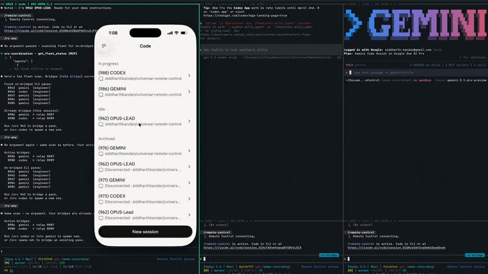

# URC — Universal Remote Control

Turn the Claude App into a command center for all your AI agents.

## Why?

You already have the Claude App on your phone. It talks to Claude Code via Remote Control. URC makes it talk to Codex and Gemini too — same app, same interface, same conversation. Plus your agents can coordinate as a team. One app. Three AI ecosystems.

## The Core: Two MCP Servers

URC provides two MCP servers that give AI agents shared infrastructure for communication and coordination:

**urc-coordination** (13 tools) — Pane-level communication via tmux. Dispatch messages to any pane, read output, register agents, track heartbeats, manage tasks. The foundation for all cross-pane work.

**urc-teams** (17 tools) — Structured cross-CLI messaging via SQLite IPC. Team creation, typed messages (9 types), task dependencies with cycle detection, stall detection, and auto-escalation. Works across Claude, Codex, and Gemini.

## The Killer App: RC Bridge

URC spawns a Haiku relay agent that acts as a pure passthrough — no interpretation, no routing. Your messages go through unchanged, output comes back verbatim.

```
Phone (Claude app)
    |  Remote Control
    v
Haiku Relay (rc-bridge agent)
    |  dispatch_to_pane / read_pane_output / signal file polling
    v
Codex or Gemini pane (tmux)
```

### Demo

One prompt from the Claude App — orchestrating Codex and Gemini, with their responses streaming back into the Claude App in real time:



## Install

### Before You Install

URC runs inside **tmux** (a terminal multiplexer). If you don't have it:
- macOS: `brew install tmux`
- Linux: `sudo apt install tmux`

**Start a tmux session:** `tmux new -s urc`

You also need **Python 3.10+**, **jq**, and **Claude Code CLI** (`curl -fsSL https://claude.ai/install.sh | bash`). Claude Max plan required for phone control.

**Optional CLIs** (install whichever you want to bridge):
- **Codex CLI**: `npm install -g @openai/codex`
- **Gemini CLI**: see [github.com/google-gemini/gemini-cli](https://github.com/google-gemini/gemini-cli)

### Option A: Git Clone (works everywhere)

```bash
git clone https://github.com/siddharthkandan/universal-remote-control
cd universal-remote-control
./setup.sh
```

`setup.sh` detects which CLIs you have installed and generates the appropriate configs.

### Option B: Claude Code Plugin (self-hosted marketplace)

Requires git with GitHub access configured. If you haven't set that up, see [GitHub's SSH guide](https://docs.github.com/en/authentication/connecting-to-github-with-ssh).

```
/plugin marketplace add siddharthkandan/universal-remote-control
/plugin install urc
```

### Option C: Claude Code Plugin Store (coming soon)

Once approved by Anthropic:

```
/install urc
```

### Gemini Setup Note

Gemini CLI requires additional configuration beyond what `setup.sh` generates:

- **Project config**: `mcpServers` must be at the **top level** in `.gemini/settings.json` (NOT nested under `"tools"`) — `setup.sh` handles this correctly
- **Global config**: If `~/.gemini/settings.json` has a `tools.allowed` whitelist, it blocks MCP tools not in the list — remove the `"tools"` block or add URC tools
- **Policy engine**: `~/.gemini/policies/` needs allow rules for all 32 URC MCP tools — `setup.sh` auto-creates these at `~/.gemini/policies/urc-mcp.toml`
- **Verify**: Run `gemini mcp list` (out of session) or `/mcp list` (in session) to confirm tools are visible
- **Note**: Gemini's `/tools` command intentionally hides MCP tools — don't use it to check MCP status

### Quick Start

From Claude Code:

```bash
/urc codex                    # Spawn new Codex pane + bridge it
/urc gemini                   # Spawn new Gemini pane + bridge it
/urc 875                      # Bridge an existing pane by ID (no % needed)
/urc                          # List unbridged panes
```

Aliases: `/rc-bridge`, `/rc-any`, `/rc-relay` all work.

You can also initiate bridges from the other side:
- **From Codex:** activate the `rc-bridge` skill
- **From Gemini:** type `/rc`

Both spawn a Claude Code Haiku relay that bridges back to their own pane. Your Claude plan covers the Haiku relay — no separate API key needed.

## Project Structure

> The root directory includes several CLI-specific files (`CLAUDE.md`, `AGENTS.md`, `GEMINI.md`, symlinks) because each AI CLI has its own conventions for discovering agent instructions. All actual code lives in `urc/`.

### Core (`urc/`)

The actual code — Python MCP servers and shell tools:

```
urc/
├── core/
│   ├── coordination_server.py    Coordination MCP server (13 tools)
│   ├── coordination_db.py        SQLite foundation
│   ├── teams_protocol.py         Teams data layer
│   ├── teams_server.py           Teams MCP server (17 tools)
│   ├── tmux-send-helper.sh       Reliable pane dispatch
│   ├── turn-complete-hook.sh     Turn completion signaling
│   ├── observer.sh               Pane state detection
│   └── jsonl_recovery.py         Audit log recovery
└── lib/
    └── state-write.sh            Atomic JSON read-modify-write
```

### CLI Integration

Each AI CLI has its own conventions for where to find agent instructions and skills. These files must be at the root or in specific dot-directories:

| File/Dir | Required by | Purpose |
|----------|-------------|---------|
| `CLAUDE.md` | Claude Code | Agent instructions (read from project root) |
| `AGENTS.md` | Codex | Agent instructions (read from project root) |
| `GEMINI.md` | Gemini | Agent instructions (read from project root) |
| `.claude/agents/` | Claude Code | RC Bridge agent definition |
| `.claude/skills/` | Claude Code | `/urc` command implementation |
| `.claude/hooks/` | Claude Code | Session init + dispatch enforcement |
| `.agents/skills/` | Codex | Codex bridge skill |
| `agents/`, `skills/` | Plugin system | Required symlinks to `.claude/` |

### Plugin System

For distribution as a Claude Code plugin:

```
.claude-plugin/plugin.json    Plugin manifest + marketplace
hooks/hooks.json              Plugin hooks (Stop + SessionStart)
hooks/scripts/plugin-setup.sh Auto-setup on first session
```

### Documentation & Setup

```
docs/                         4 guides (getting-started, architecture, teams, turn-completion)
scripts/validate-plugin.sh    Plugin validation (22 checks)
setup.sh                      One-command install
requirements.txt              Python dependencies (pinned)
.mcp.json                     MCP server config (used by all CLIs)
```

## Documentation

- [Getting Started](docs/getting-started.md)
- [Architecture Overview](docs/architecture-overview.md)
- [Teams Protocol](docs/teams-protocol.md)
- [Turn Completion System](docs/turn-completion-system.md)

## Glossary

| Term | What it means |
|------|---------------|
| **Remote Control** | A feature in the Claude Code iOS app that lets you control a Claude session from your phone |
| **MCP** | Model Context Protocol — how Claude talks to external tools and services |
| **Haiku** | Claude's fastest and cheapest model tier — used for the relay bridge since it just passes messages |
| **tmux** | A terminal multiplexer — lets you run multiple terminal sessions in panes within one window |
| **Pane** | A single terminal session inside tmux, identified by an ID like `%875` |

## Requirements

- Python 3.10+
- tmux
- jq
- Claude Code CLI
- Claude Max plan (for phone control — see [claude.com/pricing](https://claude.com/pricing))
- Codex CLI and/or Gemini CLI (optional)

## License

[MIT](LICENSE)
